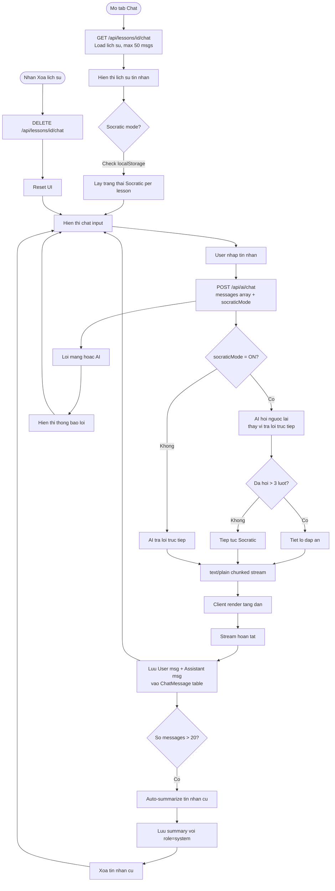
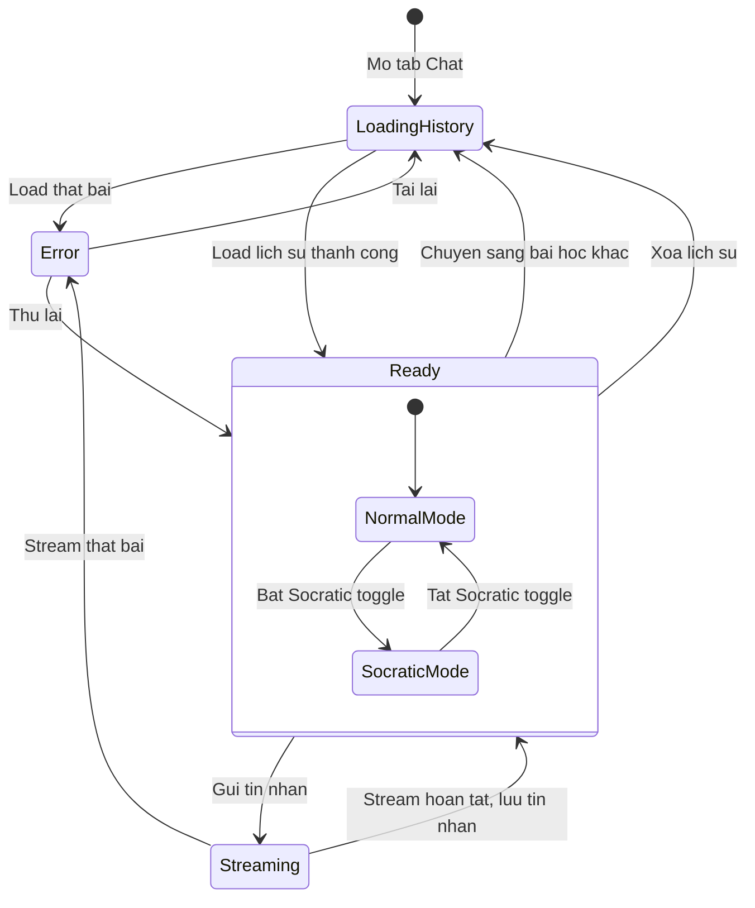

# Diagrams: AI Chat

## Flow Diagram

Chat is a streaming, history-aware conversation. Socratic mode changes how the AI responds. When history grows beyond 20 messages, old turns are summarized and pruned to keep context manageable.

## State Diagram

The chat session transitions between loading, ready, and streaming states. Socratic mode is a sub-mode of Ready, not a separate top-level state.

