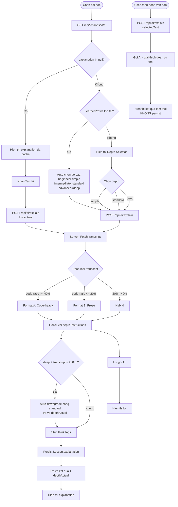
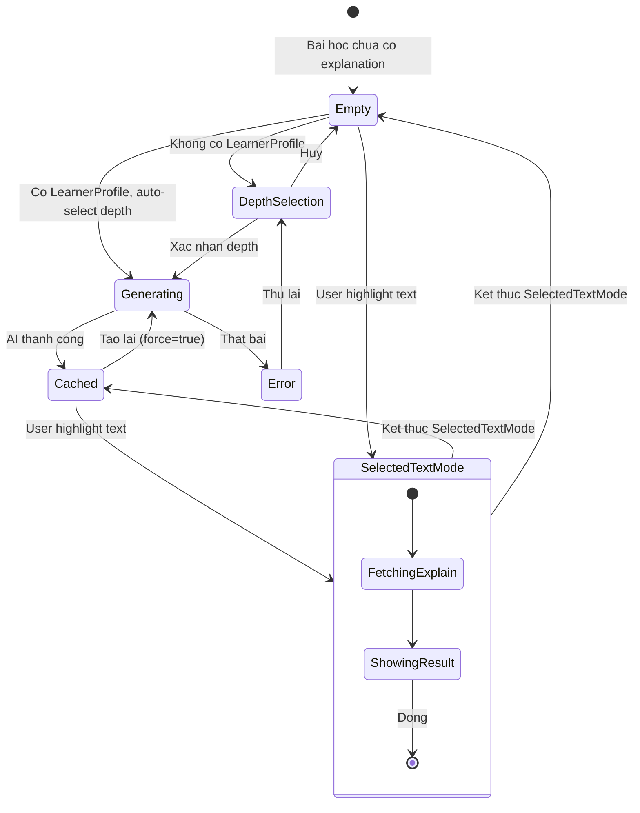

# Diagrams: AI Explain

## Flow Diagram

Explain has two distinct entry points: the standard lesson-level explanation (cached, depth-aware) and the Highlight-to-Explain shortcut (ephemeral, not persisted). LearnerProfile auto-selects depth when available.

## State Diagram

The SelectedTextMode is a parallel, ephemeral overlay that doesn't affect the primary explanation state.

