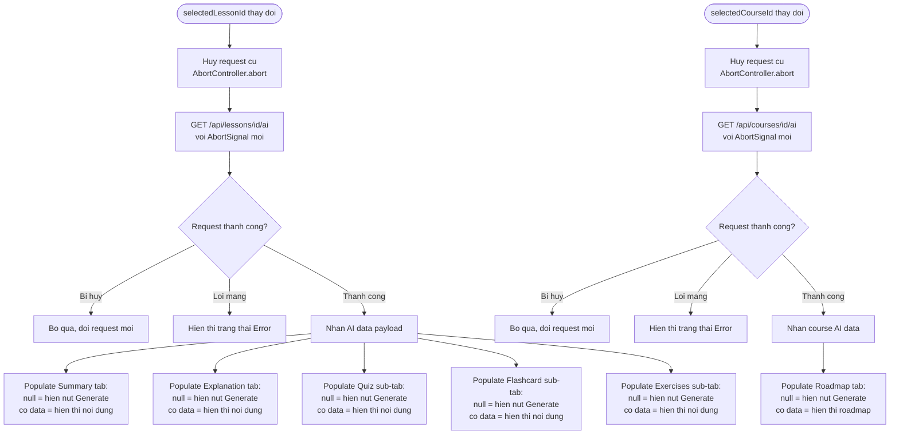
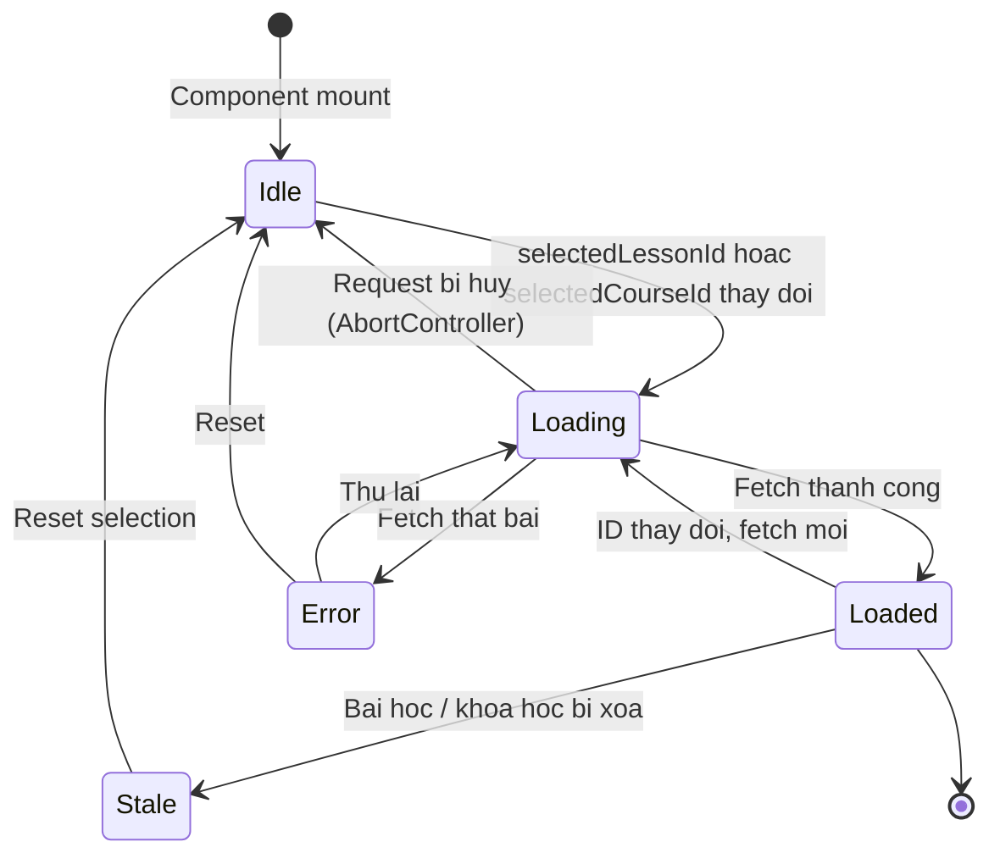

# Diagrams: AI Persistence

## Flow Diagram

Persistence is the data-loading layer that drives all AI tabs. An AbortController cancels in-flight requests when the user switches lessons or courses, preventing stale data from populating the wrong tab.

## State Diagram

The loading state machine applies to both lesson and course AI data slots. Stale covers the case where the source lesson or course has been deleted.

