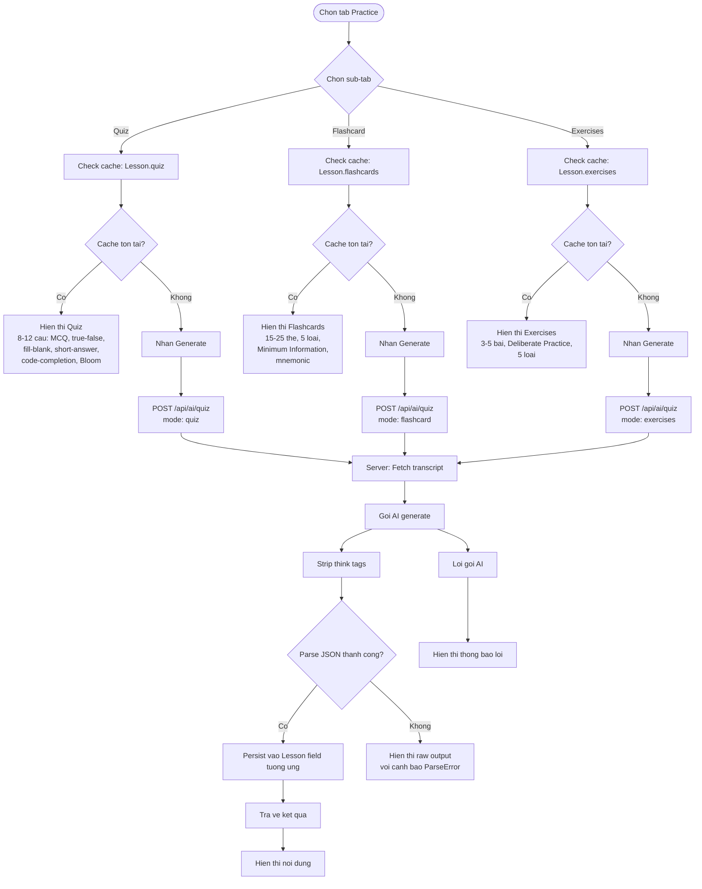
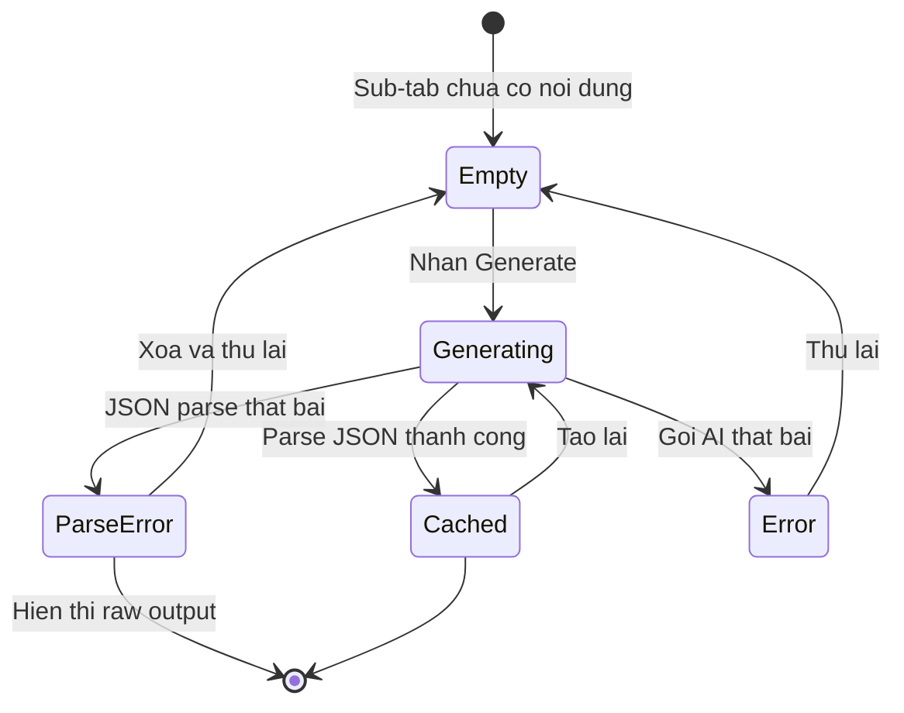

# Diagrams: AI Practice

## Flow Diagram

Practice has three sub-tabs (Quiz, Flashcard, Exercises) each with independent cache slots. All follow the same cache-first pattern, and JSON parse failures degrade gracefully by showing raw output.

## State Diagram

Each sub-tab slot is independent, but they share the same state machine pattern. ParseError is a recoverable degraded state.

