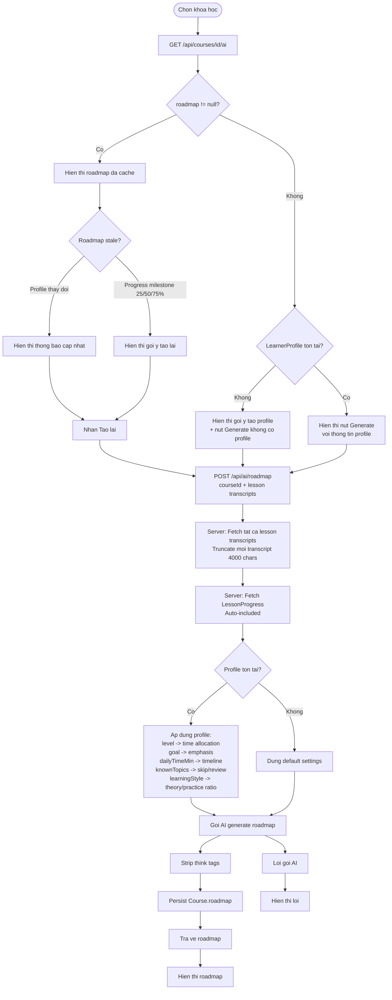
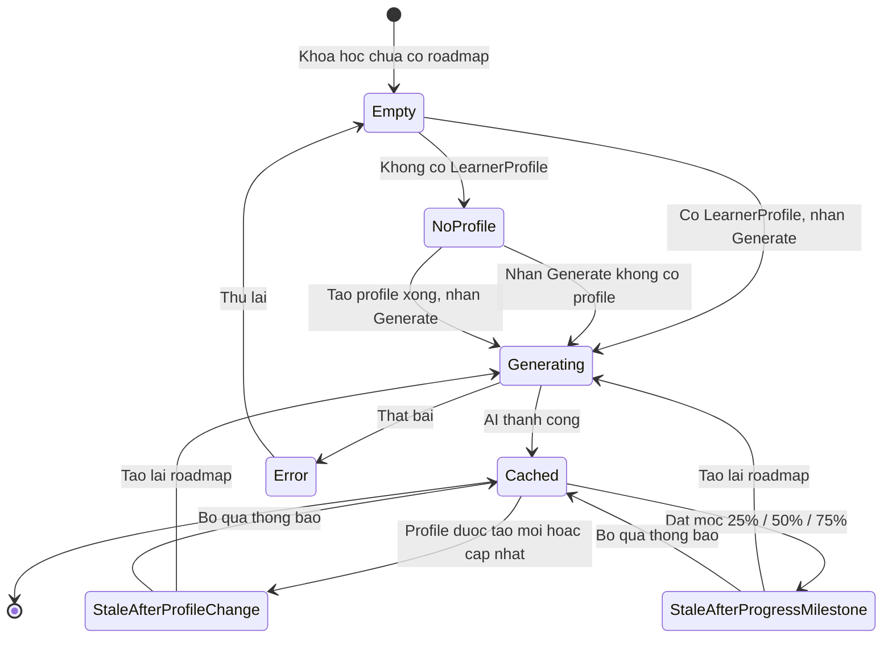

# Diagrams: AI Roadmap

## Flow Diagram

Roadmap operates at the course level and is the most profile-sensitive AI feature. Profile data shapes time allocation, emphasis, pacing, and theory/practice ratio. Progress milestones also trigger stale notifications.

## State Diagram

Roadmap can become stale via two independent triggers: profile changes and progress milestones. Both lead back through Generating.

