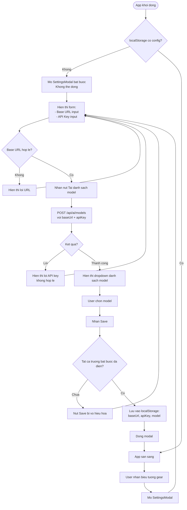
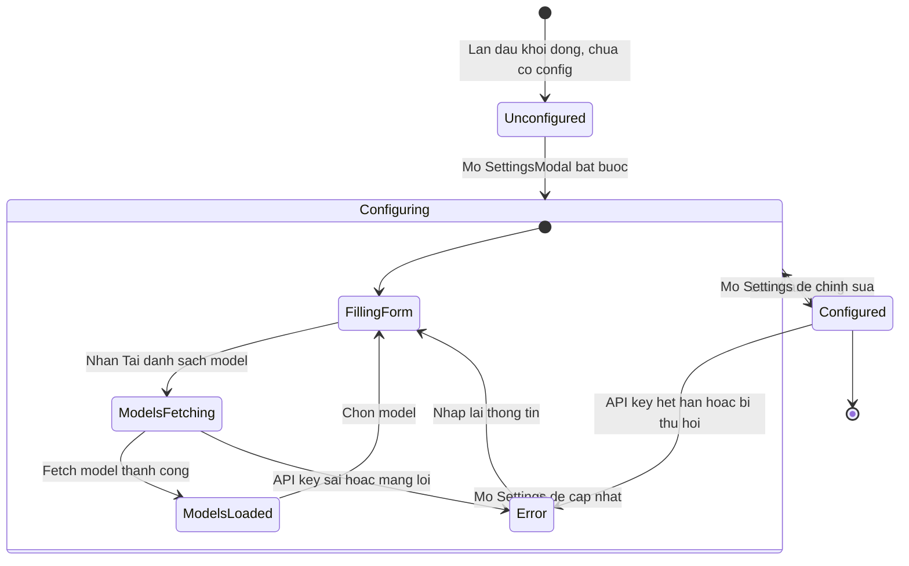

# Diagrams: AI Settings

## Flow Diagram

Settings uses a forced-modal pattern: the app is non-functional until Base URL, API Key, and model are all configured. Model list fetch doubles as API key validation.

## State Diagram

The Unconfigured state forces the modal open and blocks all other app interactions. Error can occur at either the model-fetch step or if saved credentials become invalid later.

