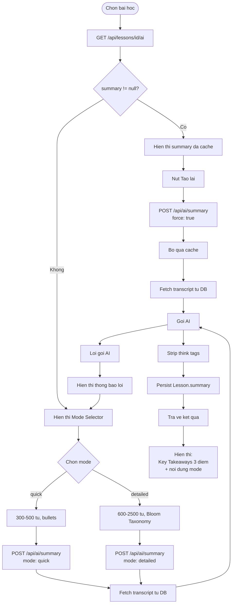
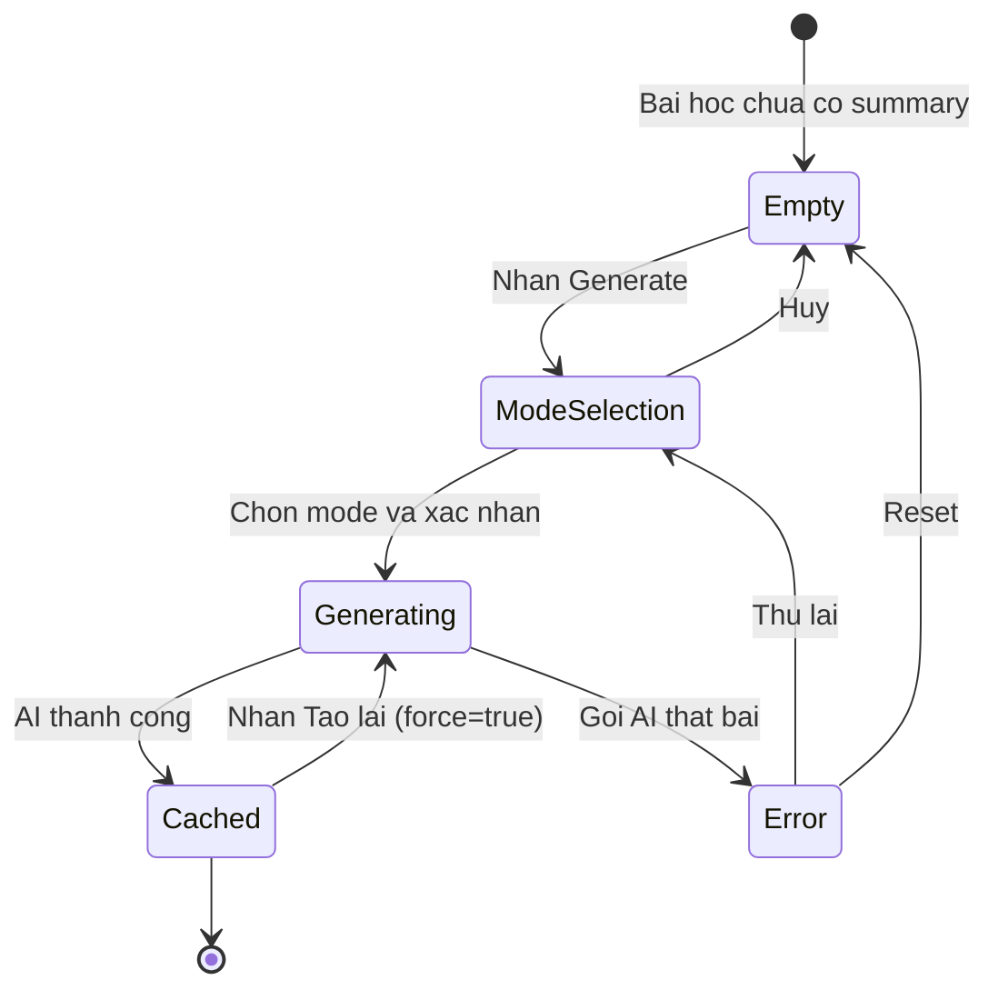

# Diagrams: AI Summary

## Flow Diagram

The main generation flow follows the cache-first pattern: check DB for existing summary, display if found, otherwise let the user pick a mode and trigger generation. The regenerate path bypasses the cache with `force:true`.

## State Diagram

Summary content cycles through five states. Once cached, the user can force a regeneration which returns it to the Generating state.

