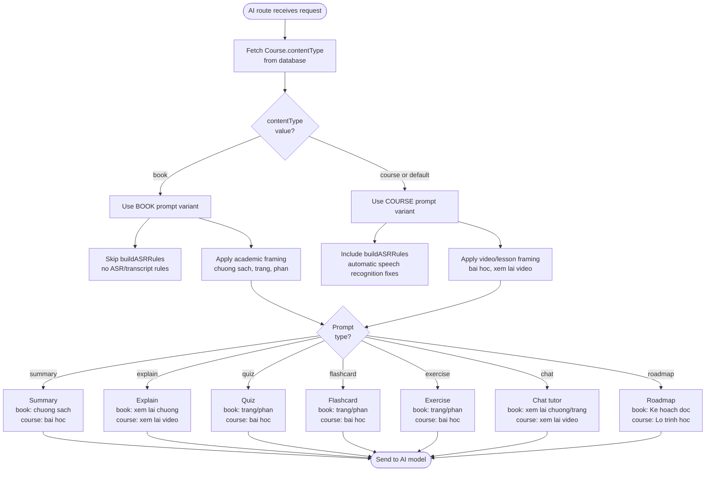
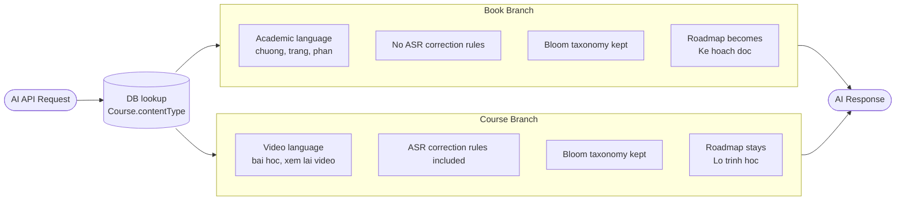

# Diagrams: Book AI Prompt Routing

## Prompt Selection Flow

How the AI route selects the correct system prompt variant based on `contentType`.

## ContentType Routing Decision Diagram

Simple view of the two routing branches and their key behavioral differences.

