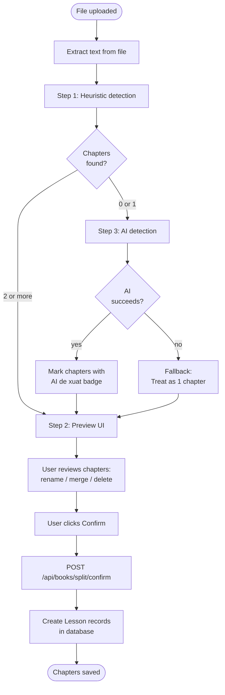
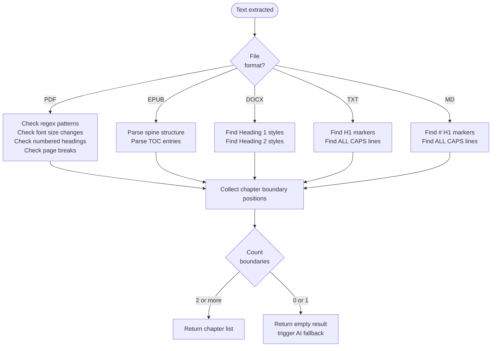
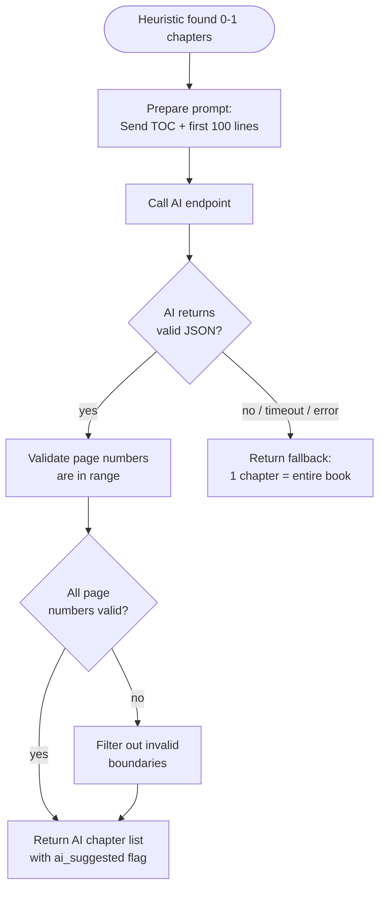

# Diagrams: Book Chapter Splitting

## Full Split Flow

The complete pipeline from file upload through chapter confirmation.



## Heuristic Detection Sub-flow

How the heuristic engine finds chapter boundaries per file format.



## AI Detection Sub-flow

How AI is used when heuristics fail to find enough chapters.



## Chapter Splitting State Diagram

States the splitting process moves through.

```mermaid
stateDiagram-v2
    [*] --> Extracting: file received

    Extracting --> HeuristicDetection: text extracted
    Extracting --> Error: extraction failed

    HeuristicDetection --> PreviewUI: 2+ chapters found
    HeuristicDetection --> AIDetection: 0-1 chapters found

    AIDetection --> PreviewUI: AI returns chapters
    AIDetection --> Fallback: AI fails or times out

    Fallback --> PreviewUI: show 1-chapter preview

    PreviewUI --> UserEditing: user modifies chapters
    UserEditing --> PreviewUI: user continues editing
    UserEditing --> Confirming: user clicks Confirm
    PreviewUI --> Confirming: user clicks Confirm without edits

    Confirming --> Complete: Lessons created in DB
    Confirming --> Error: DB write failed

    Error --> [*]
    Complete --> [*]
