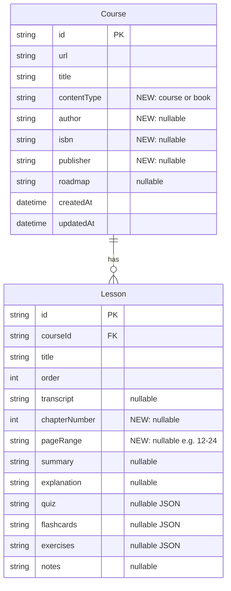
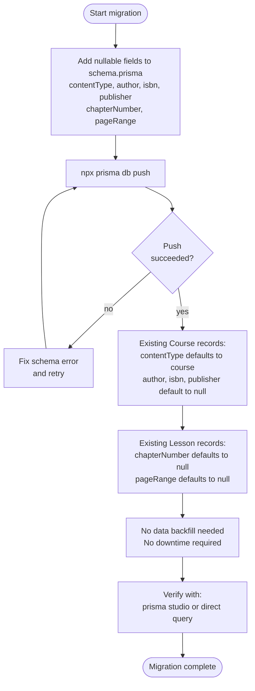

# Diagrams: Book Schema

## Entity Relationship Diagram

The full data model after migration, highlighting new fields added for book support.



## Schema Migration Flow

Steps to apply the migration with zero downtime.



## Schema Migration State Diagram

States the database schema passes through during the migration lifecycle.

```mermaid
stateDiagram-v2
    [*] --> CurrentSchema: baseline

    CurrentSchema --> MigrationPending: schema.prisma edited\nnew fields added

    MigrationPending --> MigrationApplied: npx prisma db push succeeds
    MigrationPending --> MigrationPending: push fails, fix and retry

    MigrationApplied --> Verified: query confirms new columns exist
    MigrationApplied --> MigrationPending: rollback needed

    Verified --> [*]: ready for application use
