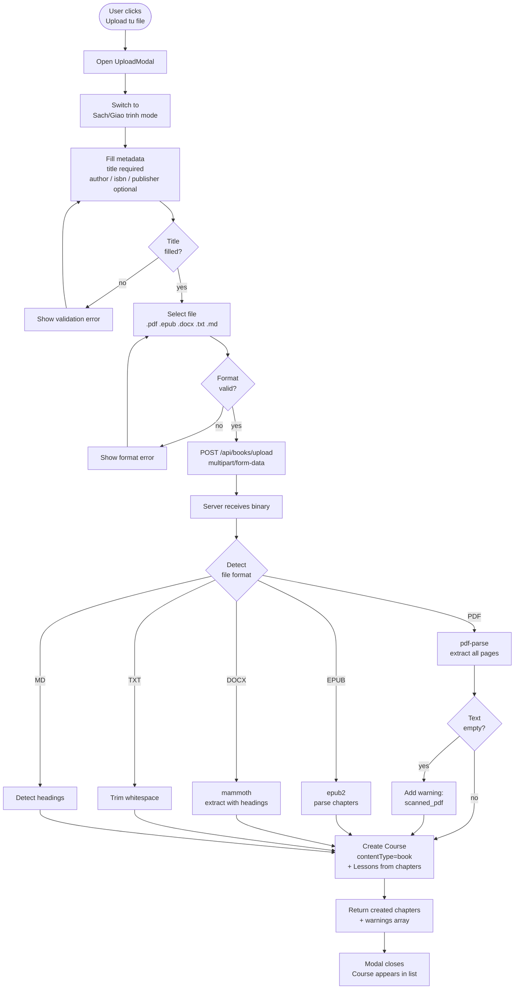

# Diagrams: Book Upload

## Main Upload Flow

End-to-end flow from clicking "Upload từ file" through to course creation.



## Per-Format Parse Sub-flows

Detail of how each format is handled on the server.

```mermaid
flowchart TD
    subgraph PDF [PDF Parsing]
        P1[Binary input] --> P2[pdf-parse]
        P2 --> P3[Extract all pages as text]
        P3 --> P4{Text\nempty?}
        P4 -->|yes| P5[warning: scanned_pdf\nCreate 1 empty Lesson]
        P4 -->|no| P6[Pass text to chapter splitter]
    end

    subgraph EPUB [EPUB Parsing]
        E1[Binary input] --> E2[epub2 library]
        E2 --> E3[Parse spine and TOC]
        E3 --> E4[Each spine item = 1 Lesson]
    end

    subgraph DOCX [DOCX Parsing]
        D1[Binary input] --> D2[mammoth extract]
        D2 --> D3[Extract text with heading styles]
        D3 --> D4{Has H1\nheadings?}
        D4 -->|yes| D5[Split at each H1]
        D4 -->|no| D6{Has H2\nheadings?}
        D6 -->|yes| D7[Split at each H2]
        D6 -->|no| D8[Single Lesson]
    end

    subgraph TXT [TXT Parsing]
        T1[Text input] --> T2[Trim whitespace]
        T2 --> T3[Single Lesson]
    end

    subgraph MD [Markdown Parsing]
        M1[Text input] --> M2{Contains\n# headings?}
        M2 -->|yes| M3[Split by H1 markers]
        M2 -->|no| M4[Treat as TXT\nSingle Lesson]
    end
```



## Book Upload State Diagram

States the upload process moves through from start to finish.

```mermaid
stateDiagram-v2
    [*] --> ModeSelection

    ModeSelection --> MetadataInput: user selects Sach/Giao trinh
    ModeSelection --> ModeSelection: user stays on Transcript mode

    MetadataInput --> FileSelected: user selects valid file
    MetadataInput --> MetadataInput: validation error

    FileSelected --> MetadataInput: user removes file
    FileSelected --> Uploading: user clicks Upload

    Uploading --> Processing: server receives file

    Processing --> Success: chapters created
    Processing --> SuccessWithWarnings: chapters created + warnings
    Processing --> Error: parse failed or server error

    Success --> [*]: modal closes
    SuccessWithWarnings --> [*]: modal closes with warning toast
    Error --> FileSelected: user can retry
