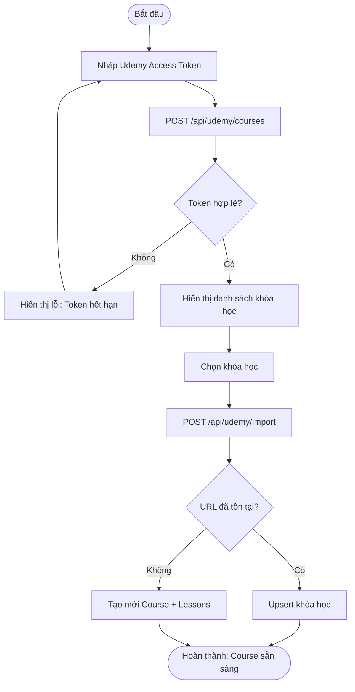
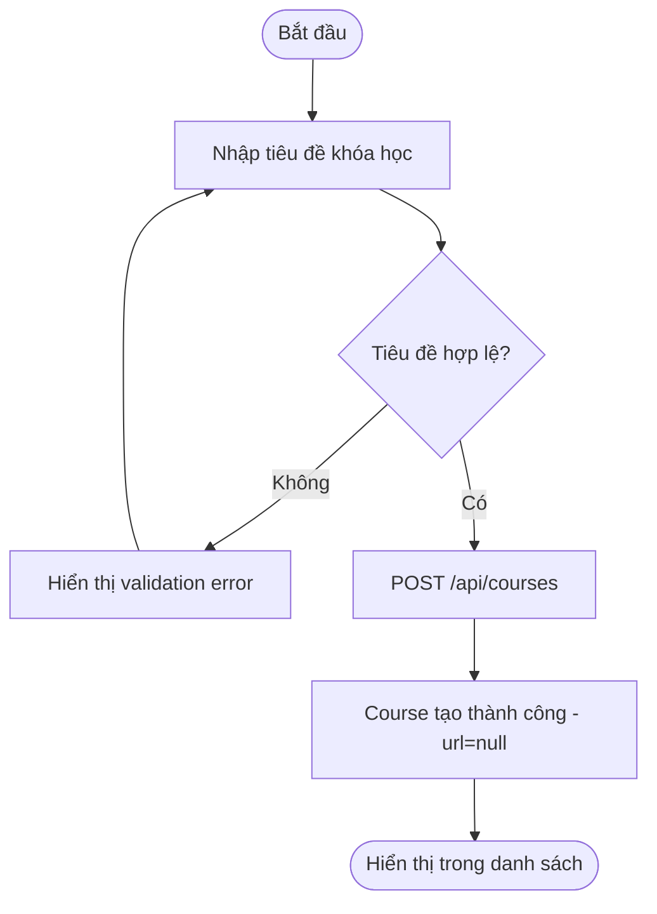
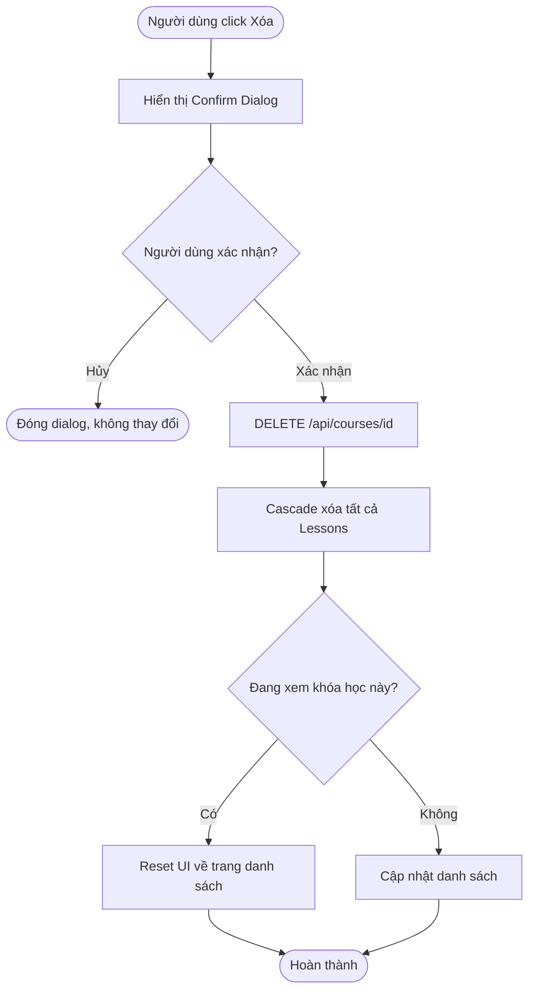
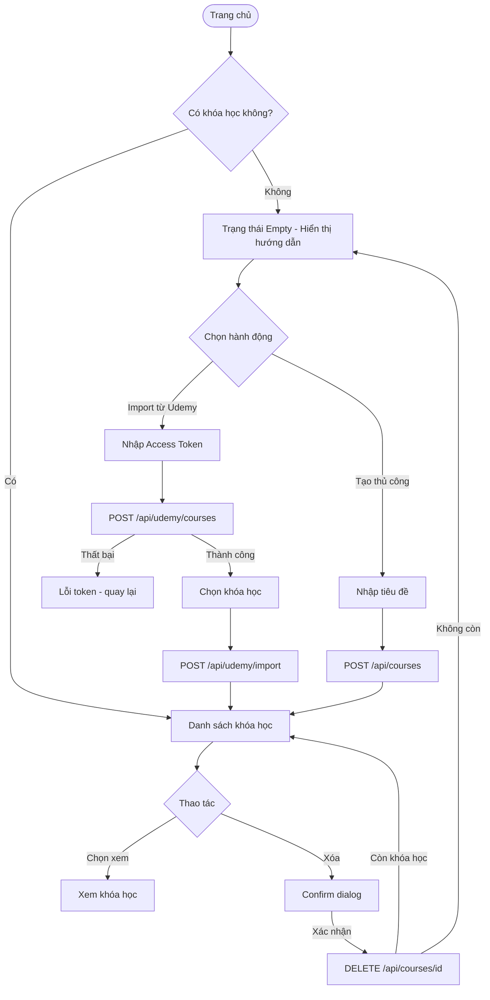
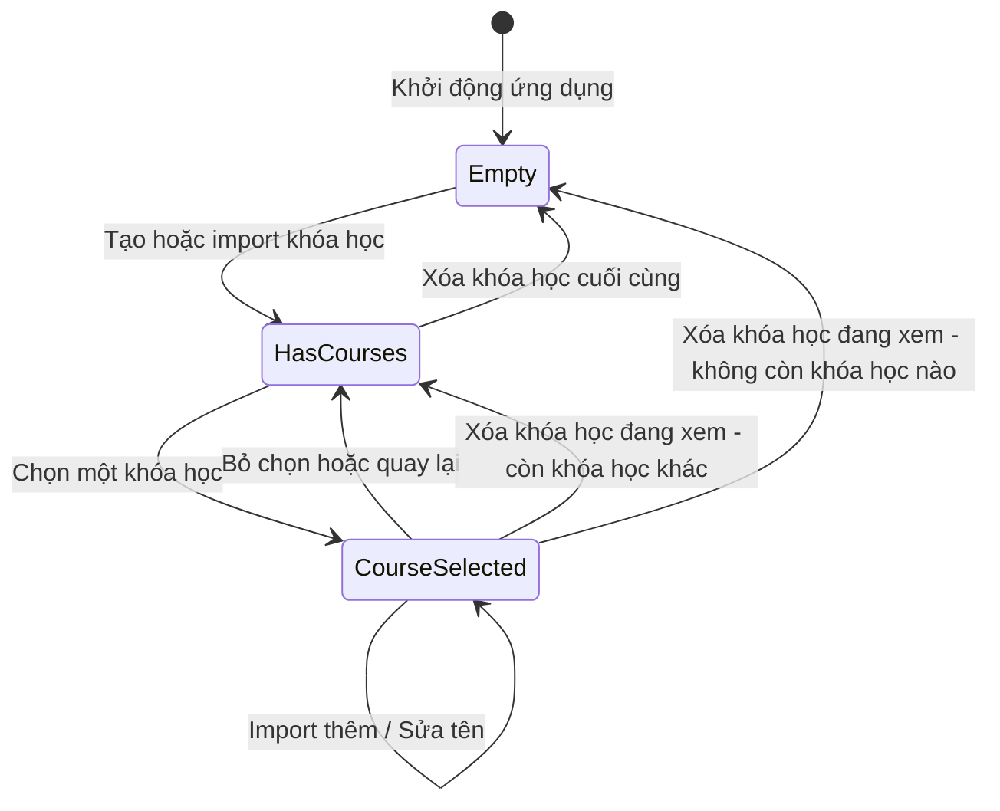

# Diagrams: Course Management

## Flow Diagrams

### Import from Udemy

Người dùng nhập access token để lấy danh sách khóa học từ Udemy, chọn khóa học, và import vào hệ thống.

### Tạo khóa học thủ công

Người dùng tạo khóa học mới bằng cách nhập tiêu đề trực tiếp, không cần kết nối Udemy.

### Xóa khóa học

Xóa khóa học sẽ cascade xóa toàn bộ lessons và dữ liệu liên quan.

### Tổng quan luồng Course Management

---

## State Diagram: Vòng đời Course

Sơ đồ trạng thái mô tả các trạng thái chính của giao diện quản lý khóa học.

