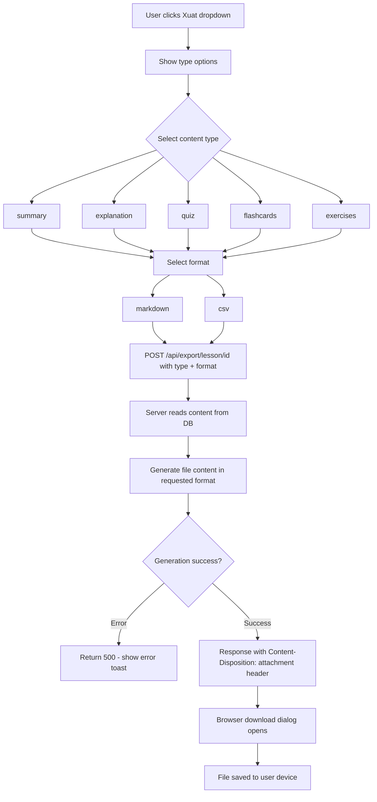
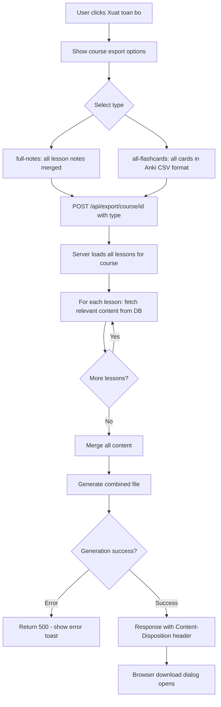
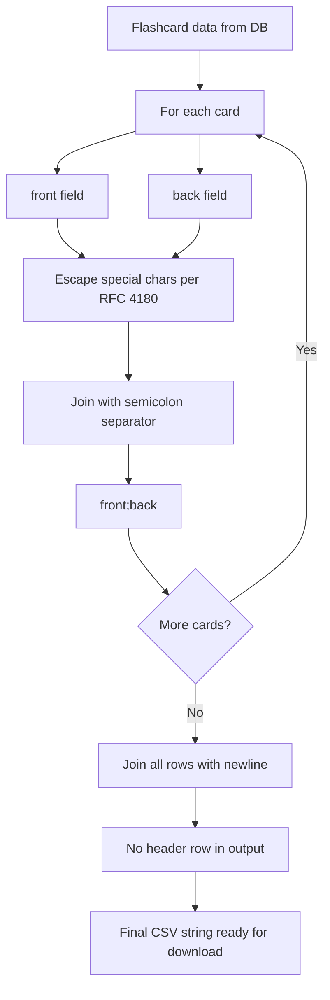
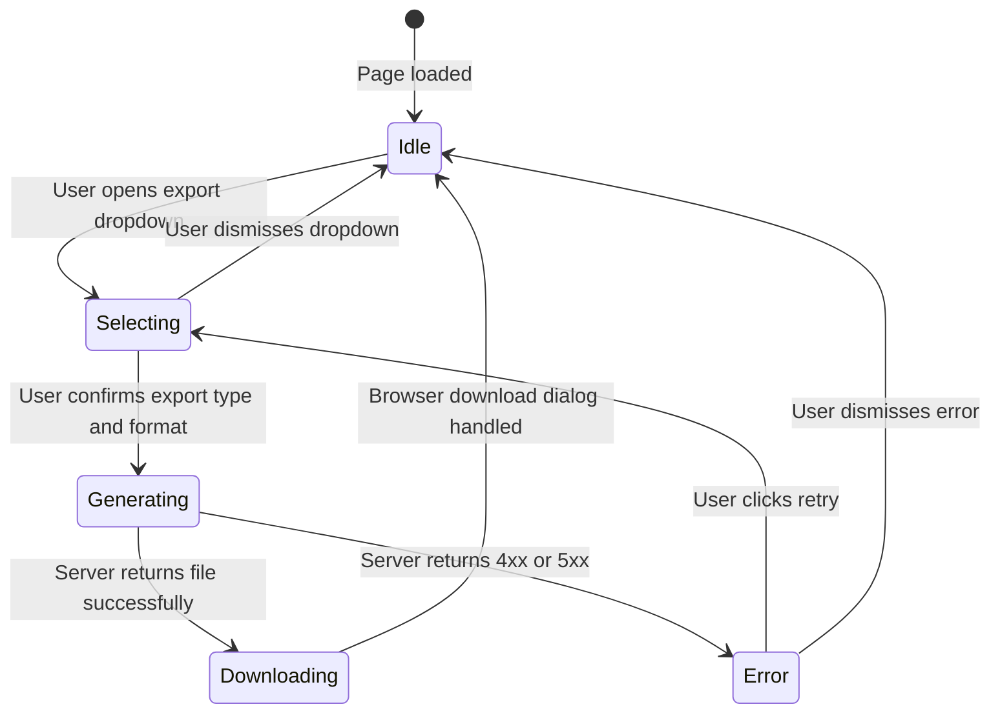

# Diagrams: Export

## Lesson Export Flow

User selects content type and format from a dropdown, the server pulls data from the database and streams back a downloadable file.

## Course Export Flow

Aggregates content across all lessons in a course into a single download.

## CSV Format (Anki-compatible)

Illustrates how flashcard data maps to the Anki-compatible CSV output format.

## Export Process State Diagram

Covers both lesson-level and course-level export paths through the same state machine.

