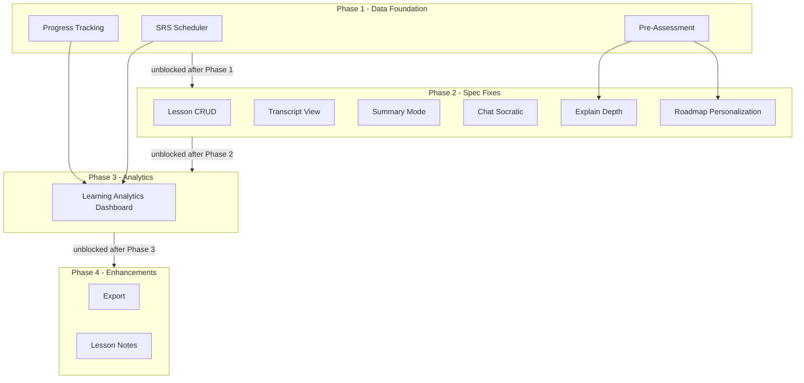
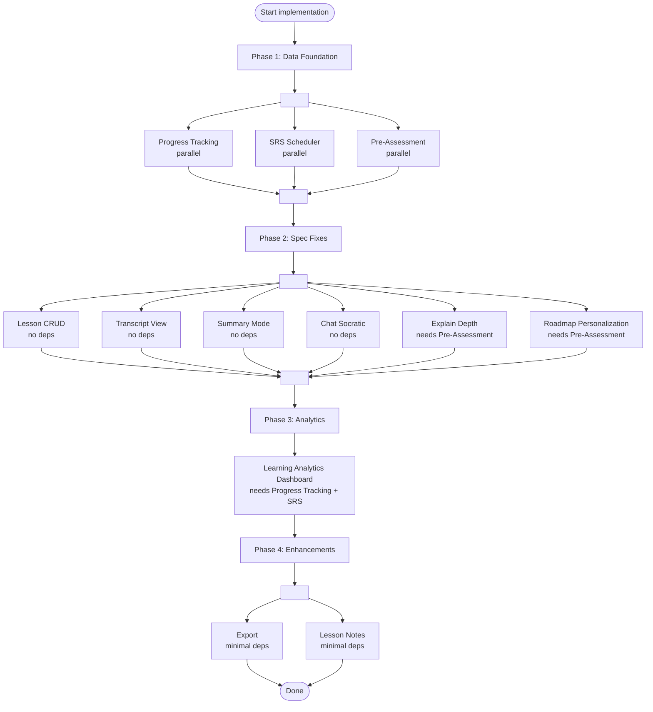

# Diagrams: Improvement Plan

## Implementation Dependency Graph

Shows which features depend on others and which can run in parallel across the 4 tiers.



## Parallel Execution Flow

Which items within each phase can run at the same time.



## Feature Dependency Flow

Explicit dependency edges showing what blocks what.

```mermaid
flowchart LR
    PT[Progress Tracking] --> LAD[Learning Analytics\nDashboard]
    SRS[SRS Scheduler] --> LAD
    PA[Pre-Assessment] --> ED[Explain Depth]
    PA --> RP[Roadmap Personalization]

    LC[Lesson CRUD]
    TV[Transcript View]
    SM[Summary Mode]
    CS[Chat Socratic]

    EX[Export]
    LN[Lesson Notes]

    style PT fill:#4a9,color:#fff
    style SRS fill:#4a9,color:#fff
    style PA fill:#4a9,color:#fff
    style LAD fill:#69b,color:#fff
    style EX fill:#999
    style LN fill:#999
