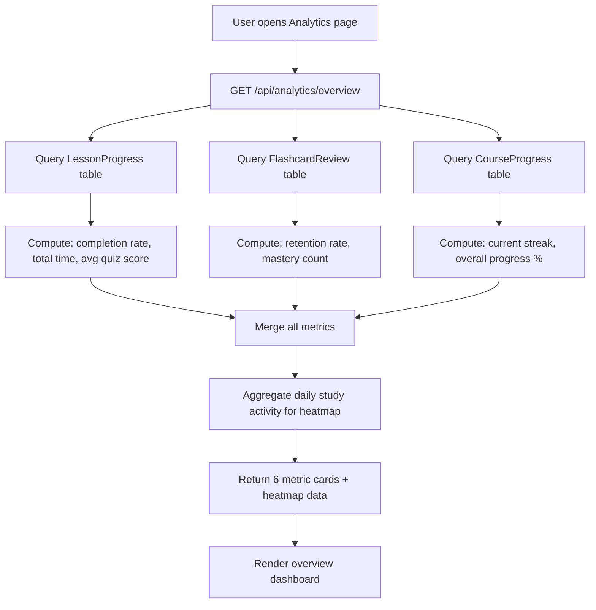
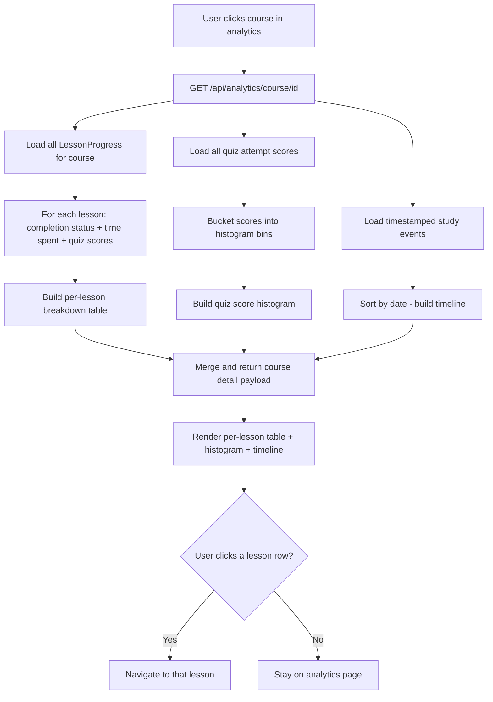
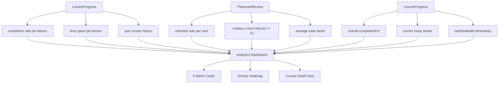

# Diagrams: Learning Analytics

## Overview Analytics Flow

The overview page aggregates data from three sources and renders metric cards plus a study activity heatmap.

## Course Detail Analytics Flow

Drills down into per-lesson data for a specific course, showing quiz score distribution and a study timeline.

## Data Sources and Metrics Flow

Shows how each data source feeds into the analytics layer. This is a read-only aggregation - no writes occur.

