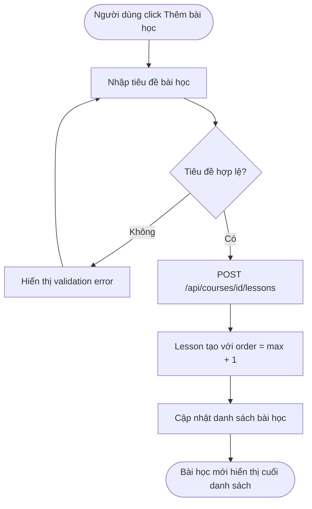
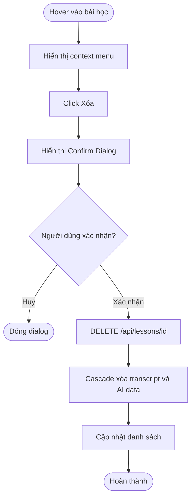
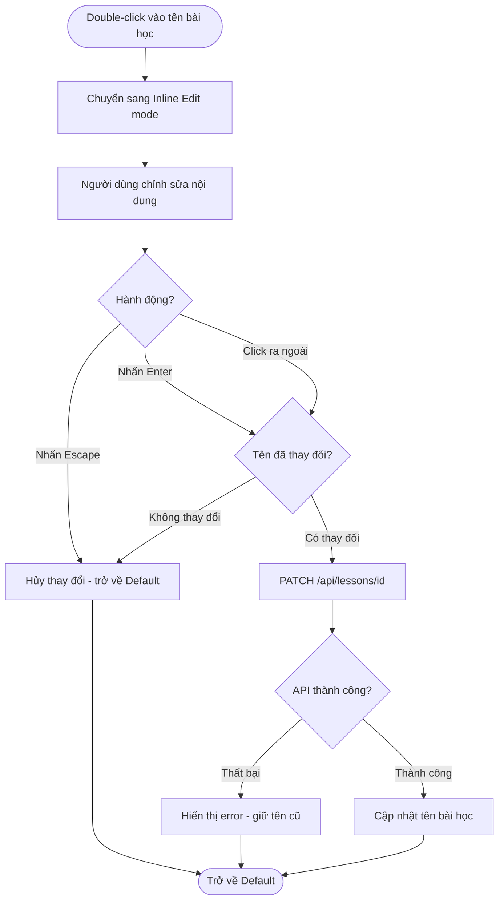
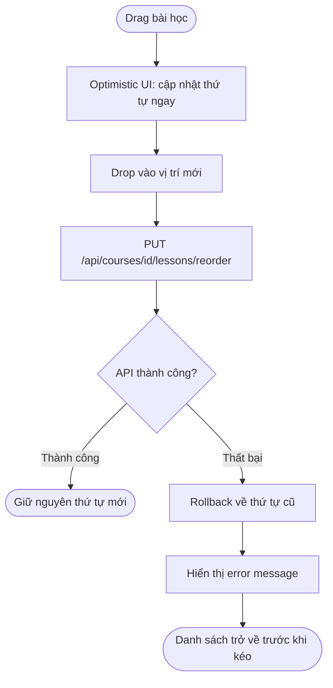

# Diagrams: Lesson Management

## Flow Diagrams

### Thêm bài học mới

Người dùng tạo bài học mới trong khóa học, hệ thống tự động gán thứ tự cuối cùng.



### Xóa bài học

Xóa bài học cascade xóa transcript và dữ liệu AI liên quan.



### Đổi tên bài học

Người dùng double-click để chỉnh sửa tên bài học trực tiếp trong danh sách.



### Sắp xếp lại thứ tự bài học

Người dùng kéo thả để thay đổi thứ tự bài học, UI cập nhật ngay lập tức (optimistic update).



---

## State Diagram: Trạng thái Lesson Item

Sơ đồ trạng thái mô tả các trạng thái tương tác của một bài học trong danh sách.

```mermaid
stateDiagram-v2
    [*] --> Default: Bài học được load

    Default --> Hover: Chuột di vào
    Hover --> Default: Chuột di ra
    Hover --> ContextMenu: Click menu icon
    ContextMenu --> Default: Click ra ngoài hoặc Escape
    ContextMenu --> Deleting: Click Xóa

    Default --> Editing: Double-click vào tên
    Editing --> Default: Escape hoặc Click ra ngoài - không thay đổi
    Editing --> Default: Enter hoặc Blur - lưu thành công
    Editing --> Default: API lỗi - rollback tên cũ

    Default --> Selected: Click chọn bài học
    Selected --> Default: Click bài học khác
    Selected --> Editing: Double-click khi đang Selected
    Selected --> ContextMenu: Click menu icon khi Selected

    Deleting --> Default: Hủy dialog
    Deleting --> [*]: Xác nhận xóa
```
