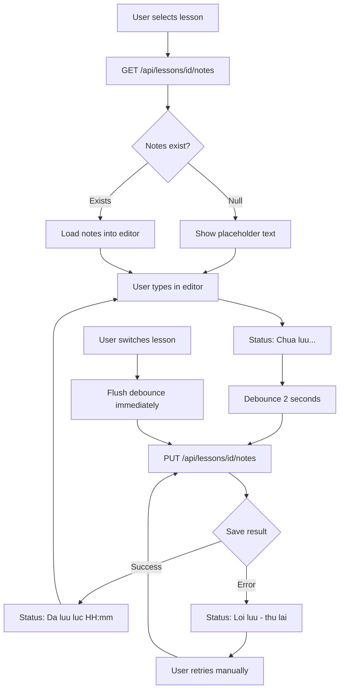
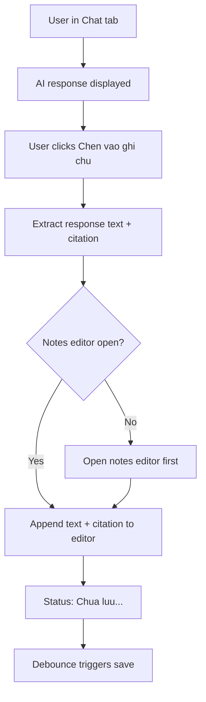
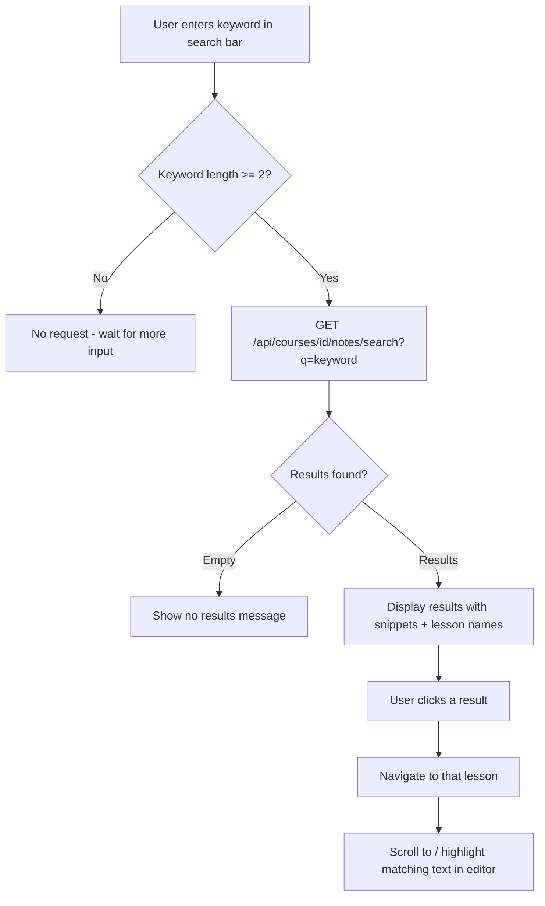
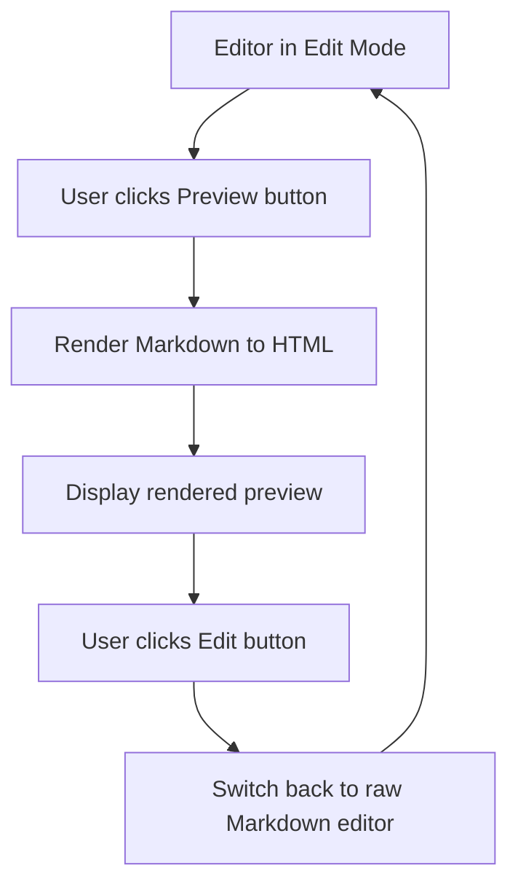
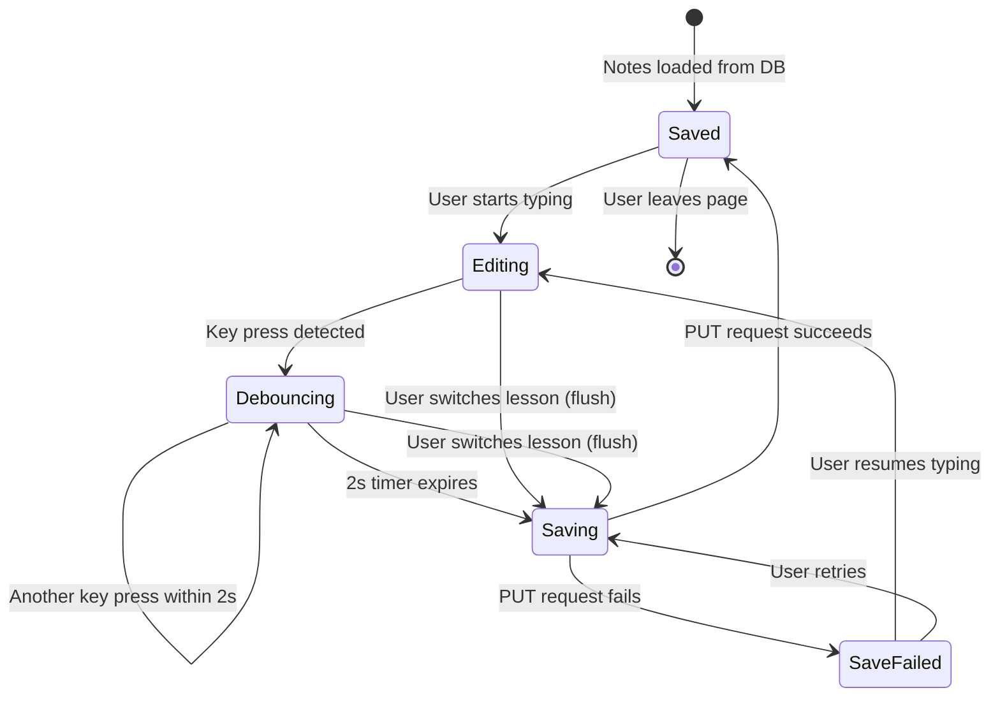

# Diagrams: Lesson Notes

## Note Editing Flow

User selects a lesson, the app loads existing notes from the database and renders them in the editor. Changes trigger a 2-second debounce before auto-saving. Status indicators keep the user informed throughout.

## Insert from AI Flow

When the user clicks "Chèn vào ghi chú" on an AI response in the Chat tab, the cited text appends to the current notes editor.

## Search Notes Flow

Search runs across all notes for a course, returns snippets, and navigates to the matching lesson on click.

## Preview Toggle Flow

The editor supports two modes: raw Markdown editing and rendered HTML preview.

## Note Save Status State Diagram

Tracks the lifecycle of the save status indicator shown to the user.

