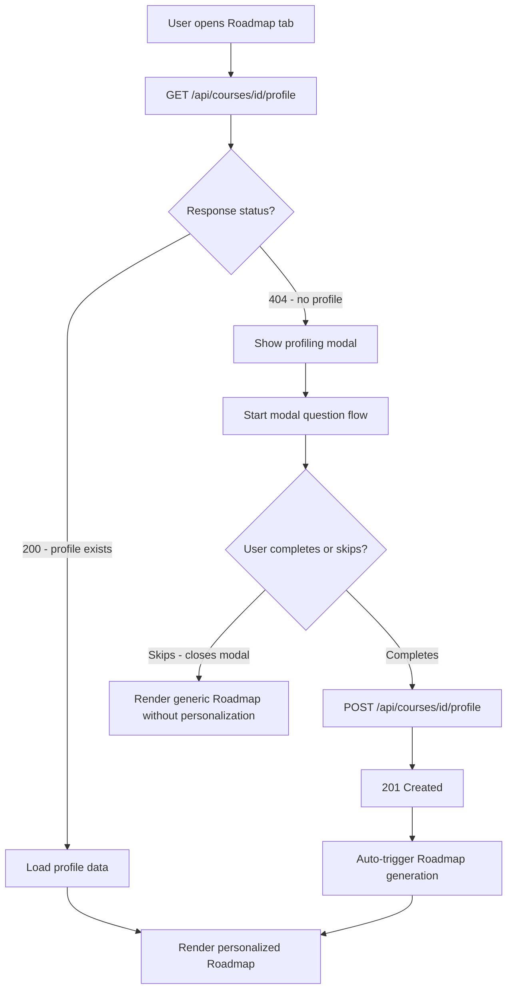
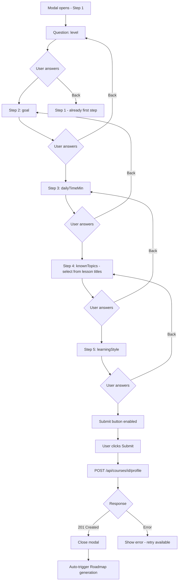
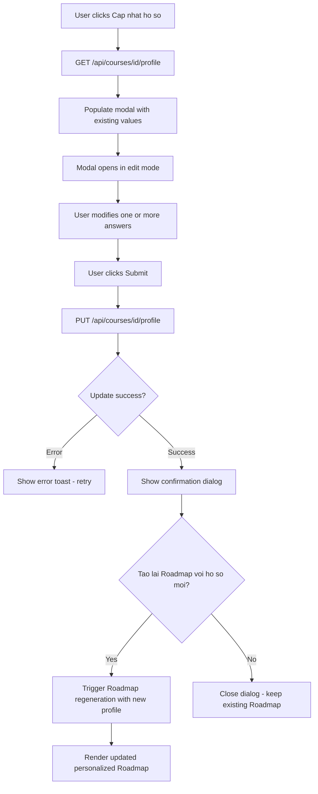
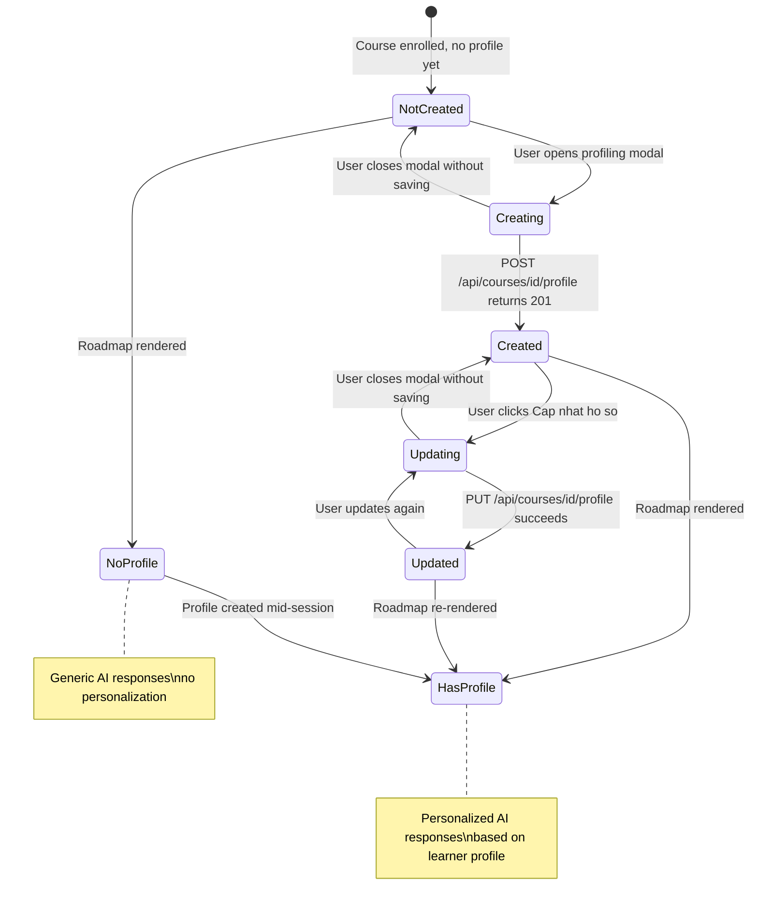

# Diagrams: Pre-Assessment

## Profile Trigger Flow

The first time a user opens the Roadmap tab, the app checks for an existing profile. A 404 response triggers the profiling modal.

## Modal Question Flow

Five questions collected in sequence. Users can navigate back to revise earlier answers before submitting.

## Update Profile Flow

Users can update their profile at any time. A confirmation dialog offers to regenerate the Roadmap with the new data.

## LearnerProfile Lifecycle State Diagram

Tracks the full profile from non-existence through creation, updates, and how it affects AI personalization.

