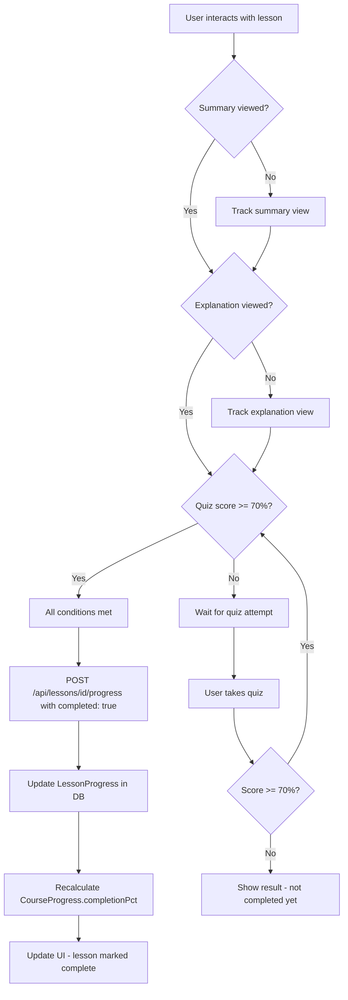
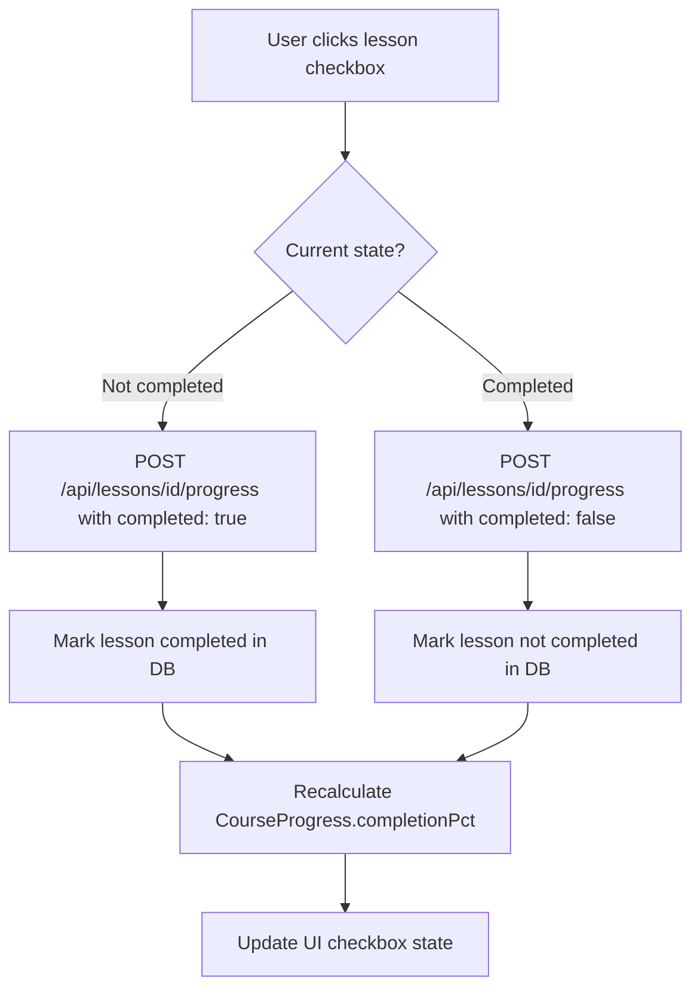
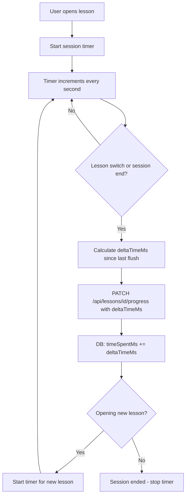
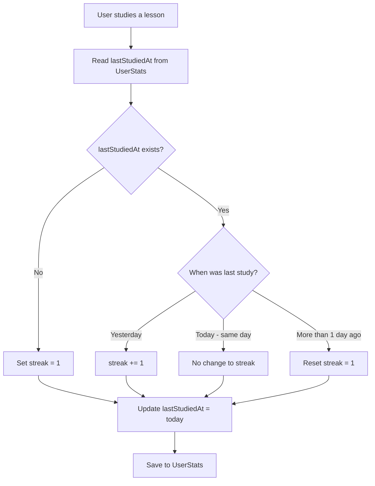
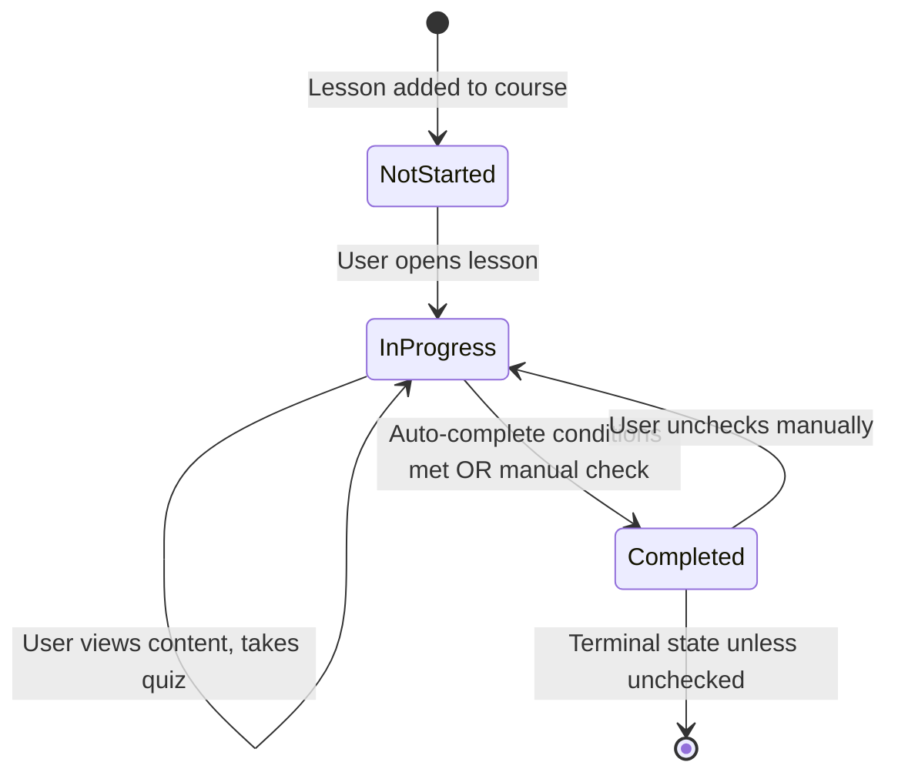
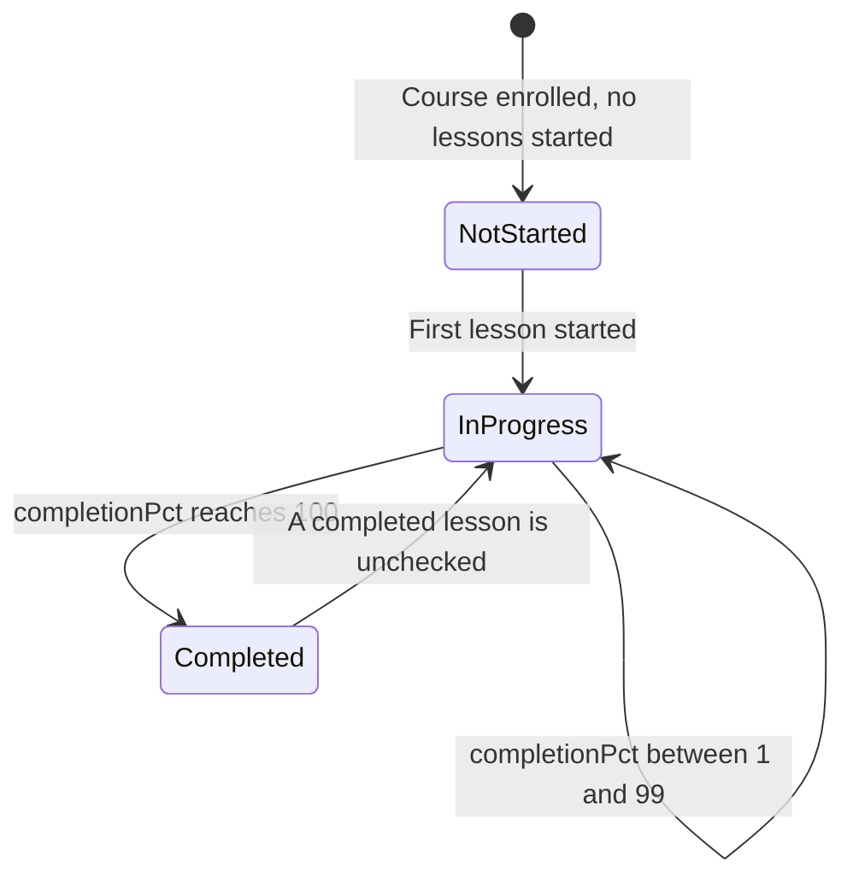
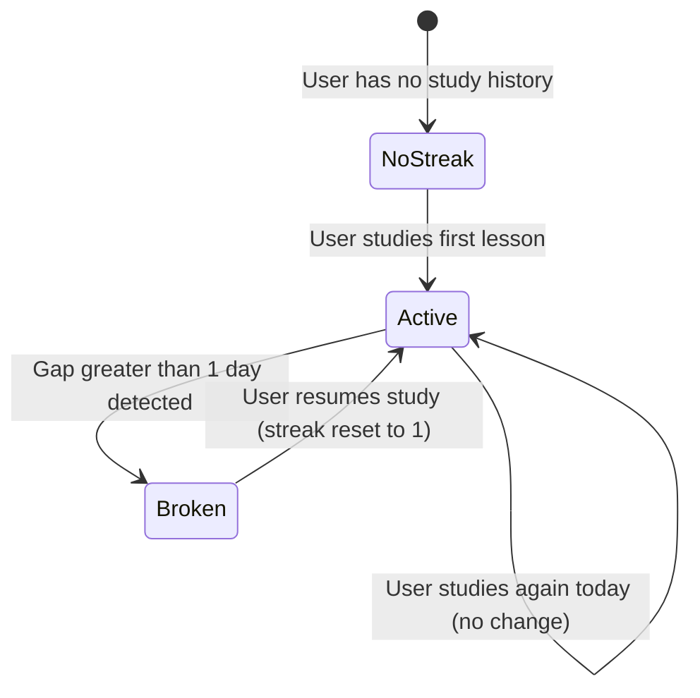

# Diagrams: Progress Tracking

## Auto-Complete Flow

The system marks a lesson completed automatically when three conditions are all met: the summary was viewed, the explanation was viewed, and the quiz score reached 70% or higher.

## Manual Complete Flow

Users can toggle lesson completion manually via a checkbox, overriding auto-complete logic.

## Time Tracking Flow

Session time accumulates incrementally. Each lesson switch or session end flushes the delta to the server without overwriting cumulative time.

## Streak Logic Flow

The streak counter tracks consecutive daily study sessions, resetting on any gap longer than one day.

## LessonProgress State Diagram

## CourseProgress State Diagram

## Streak State Diagram

