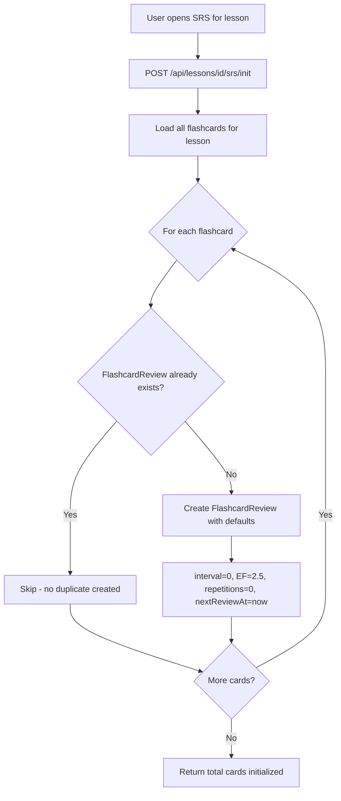
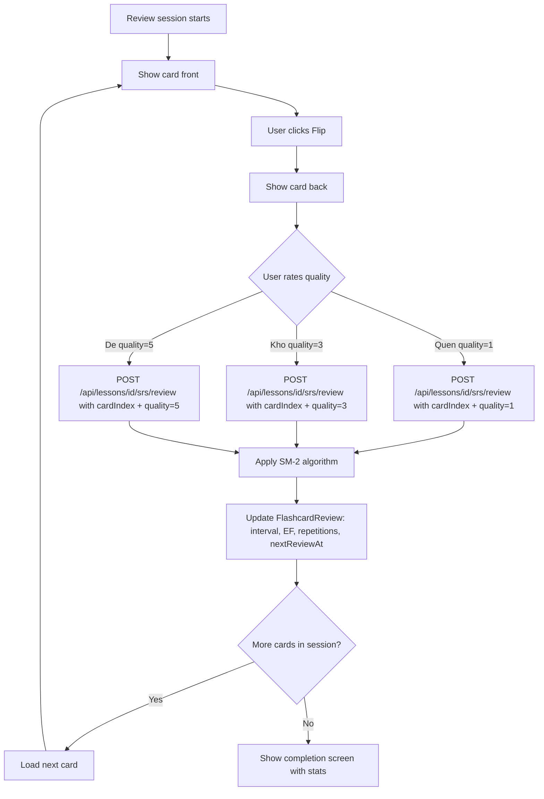
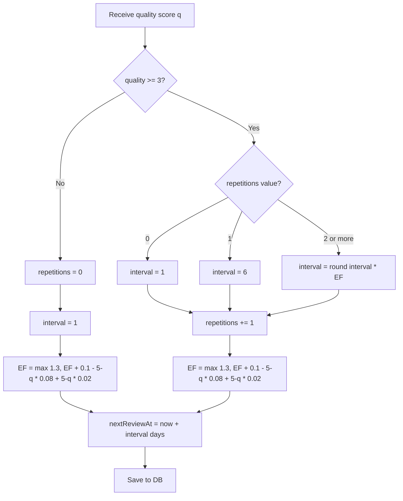
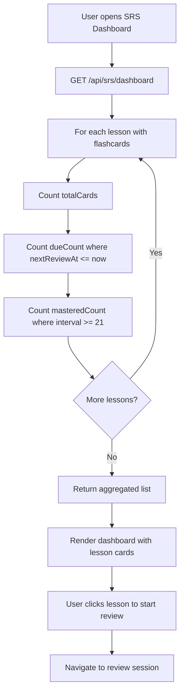
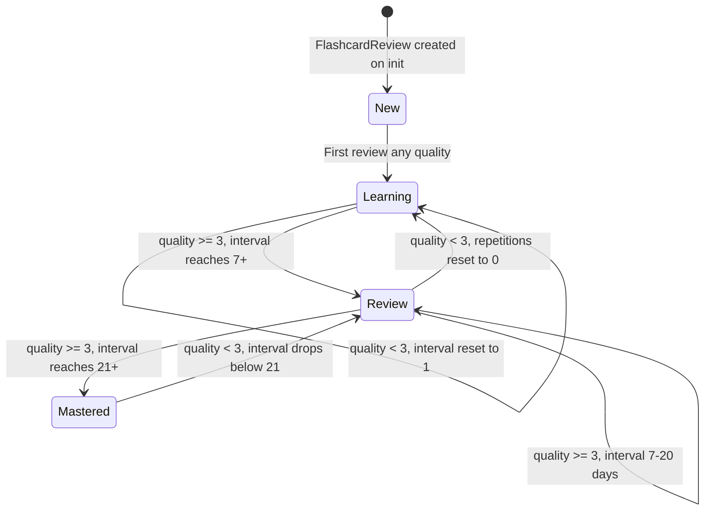

# Diagrams: SRS Scheduler

## SRS Initialization Flow

Creates FlashcardReview records for every card in a lesson. The operation is idempotent - existing cards are skipped.



## Due Cards Flow

Fetches only cards that are due for review right now.

```mermaid
flowchart TD
    A[User opens SRS review session] --> B[GET /api/lessons/id/srs/due]
    B --> C[Query: nextReviewAt <= now()]
    C --> D{Any due cards?}
    D -->|None| E[Show all-caught-up screen]
    D -->|Has cards| F[Return due card list]
    F --> G[Start review session with first card]
```

## Review Session Flow

The main review loop: show each card, collect quality rating, apply SM-2, then move to next card.



## SM-2 Algorithm Flow

Calculates the next review interval and ease factor for a given quality score.



## SRS Dashboard Flow

Aggregates per-lesson SRS stats for the dashboard overview.



## FlashcardReview SM-2 Lifecycle State Diagram

Cards progress through stages based on interval length. Forgetting a card resets it to Learning.


