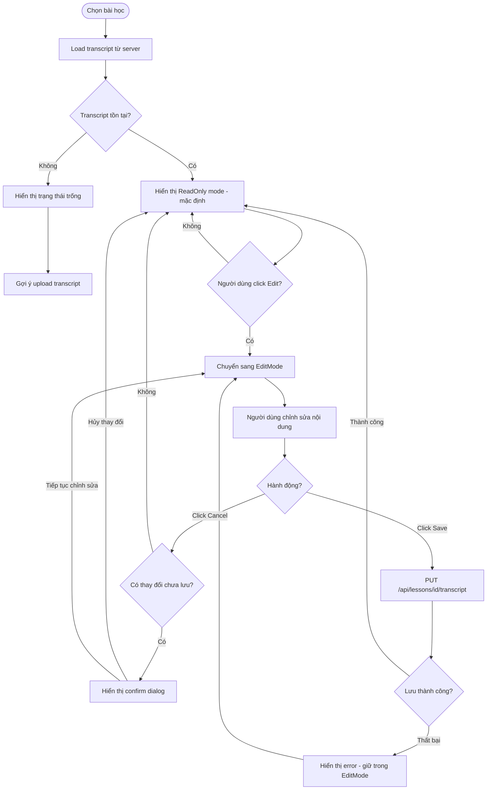
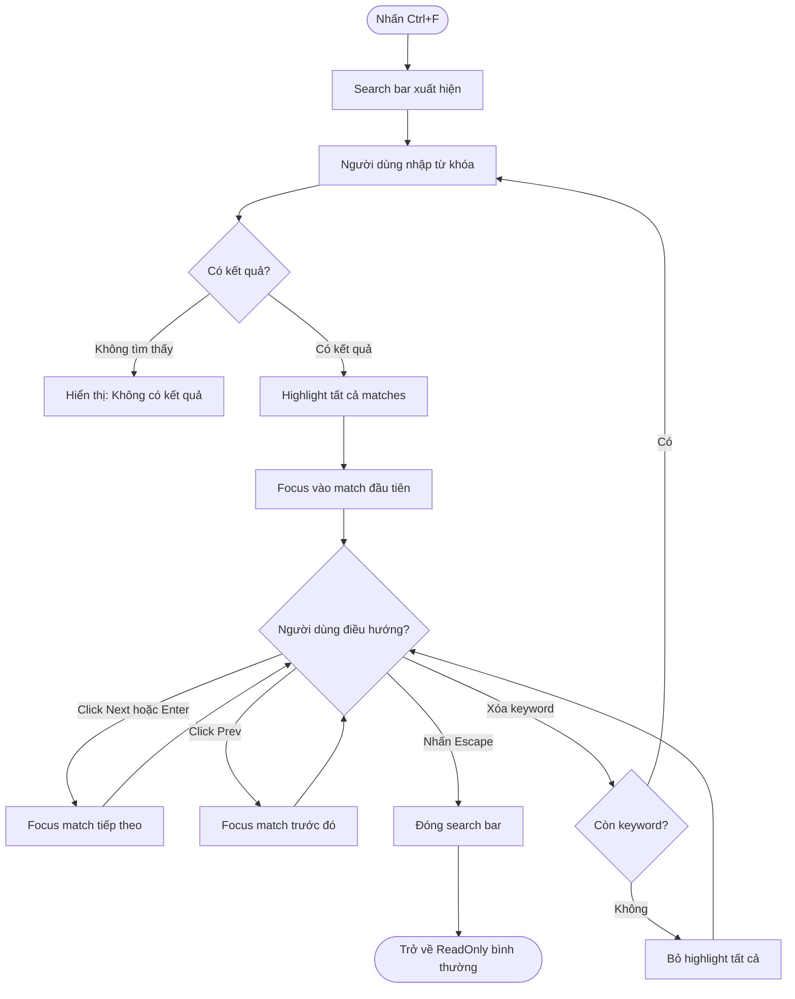
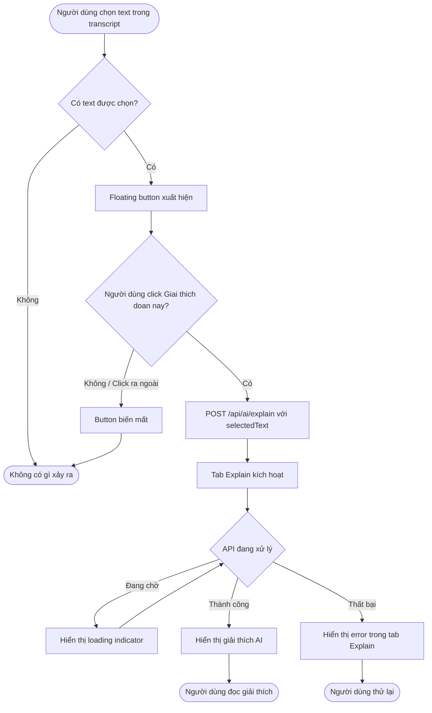
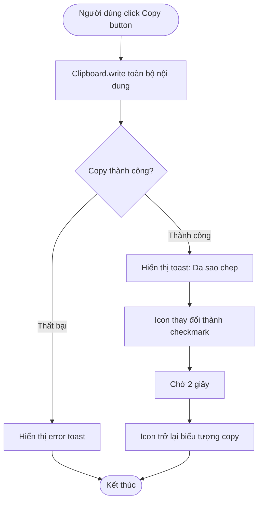
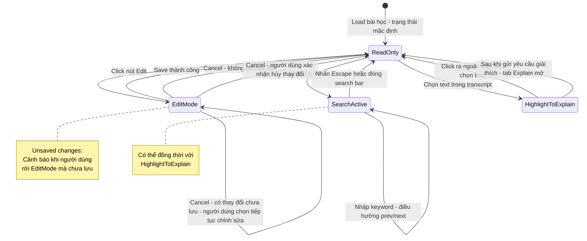

# Diagrams: Transcript

## Flow Diagrams

### Xem và chỉnh sửa Transcript

Người dùng xem transcript ở chế độ ReadOnly mặc định, có thể chuyển sang Edit để chỉnh sửa nội dung.

### Tìm kiếm trong Transcript

Người dùng dùng Ctrl+F để tìm kiếm từ khóa và điều hướng qua các kết quả.

### Highlight để Giải thích (AI Explain)

Người dùng chọn đoạn text, nhận giải thích AI cho đoạn đó.

### Copy Transcript

---

## State Diagram: TranscriptPanel Modes

Sơ đồ trạng thái mô tả các chế độ hoạt động của TranscriptPanel và điều kiện chuyển đổi.

