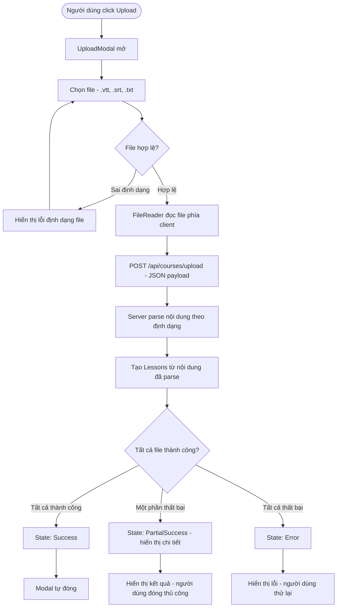
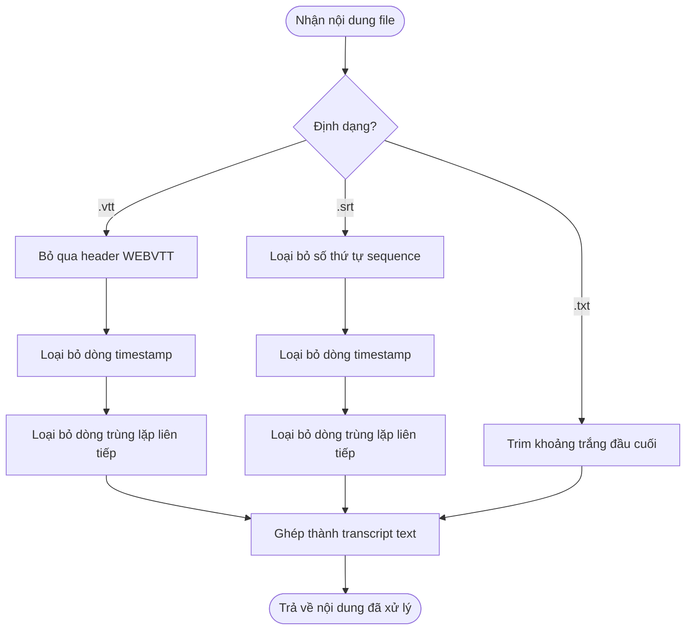
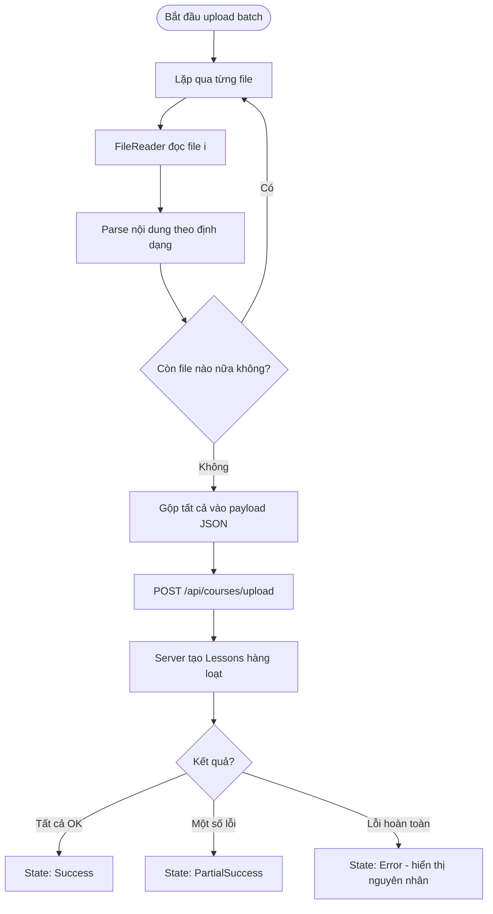
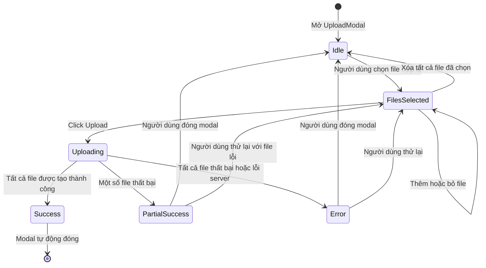

# Diagrams: Upload Transcript

## Flow Diagrams

### Luồng Upload tổng quan

Người dùng upload file transcript (.vtt/.srt/.txt), hệ thống đọc và parse file phía client trước khi gửi lên server.

### Parse logic theo định dạng

Server xử lý nội dung khác nhau tùy theo định dạng file.

### Luồng xử lý nhiều file

---

## State Diagram: Trạng thái Upload

Sơ đồ trạng thái mô tả vòng đời của quá trình upload từ lúc mở modal đến khi hoàn thành.

