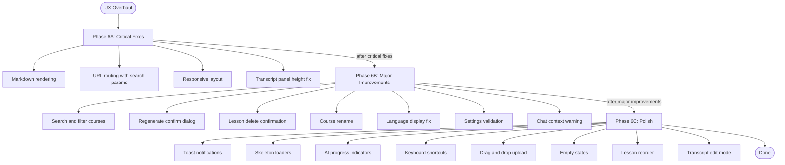
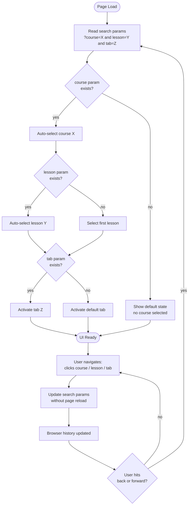
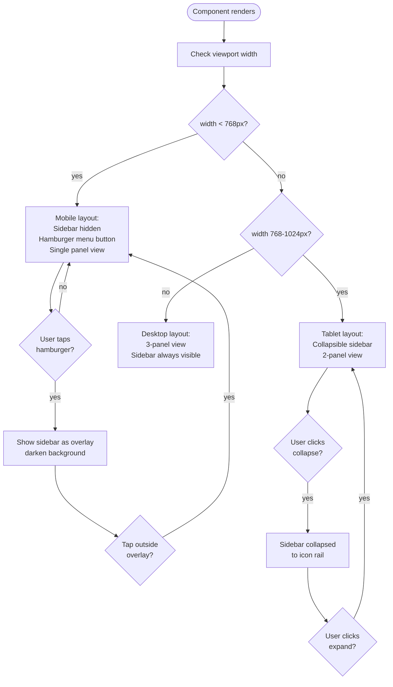
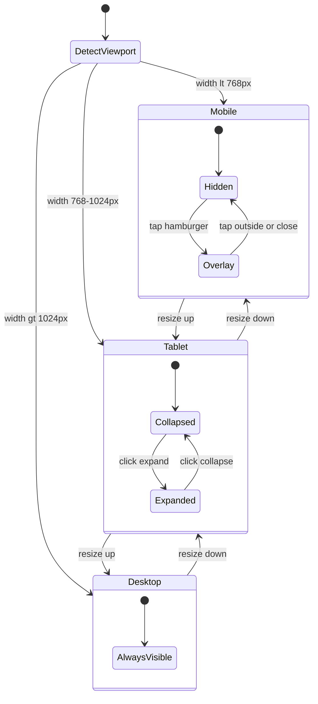

# Diagrams: UX Overhaul (Phase 6)

## Phase Overview Flow

High-level view of the three sub-phases and their items, ordered by priority.

## URL Navigation Flow

How the app reads and writes URL search params to enable deep linking and browser history.

## Responsive Layout Flow

How the layout adapts based on viewport width.

## Responsive Layout State Diagram

Entity states for the sidebar across breakpoints.

